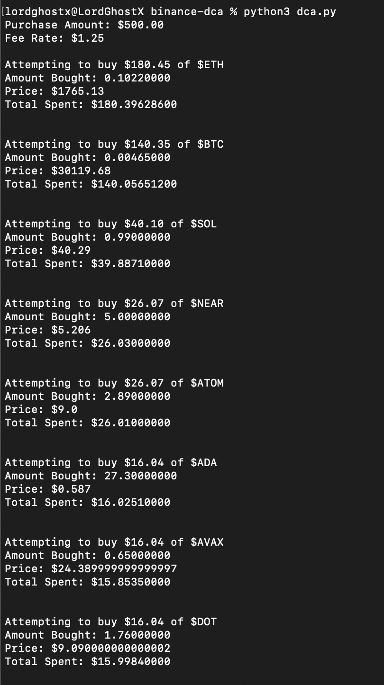
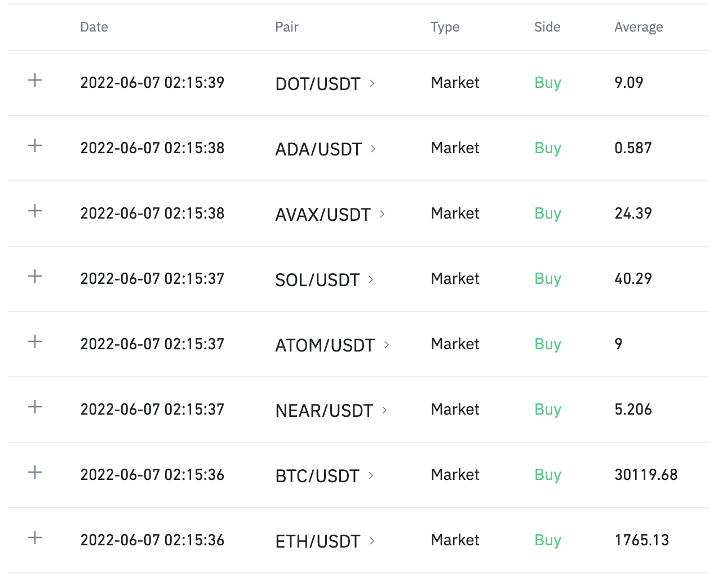

# Binance DCA Script

In summary, this code is a [Dollar Cost Averaging (DCA)](https://www.investopedia.com/terms/d/dollarcostaveraging.asp) script. It will purchase a specified cryptocurrency set with your Binance account whenever you run it.

## Config Variables

You will need to add the following config variables to your `config.json` file to run this project.

| Parameter | Type | Description |
| - | - | - |
| keys | object | Your API keys gotten from Binance. See the [Create API](https://www.binance.com/en/support/faq/360002502072) guide to learn how to get them. |
| keys.api | string | Your Binance `API key` |
| keys.secret | string | Your Binance `SECRET key` |
| coins | object | A key-value pair of coins the script should purchase and their allotted percentages of the total balance, e.g., `"BTC": 20` means `20%` of the total balance should be used to buy `$BTC` |
| quote_asset | string | The quote asset to purchase the coins with, e.g., `USDT` means all the trades will be executed on `{{coin}}/USDT` market pairs |
| amount | number | The total balance the script should spend on purchases, e.g., `1000` means the script should make all its purchases with `$1000` |
| fee | number | A percentage value to account for Binance trading fees, e.g., `0.15` means the script should purchase an additional `0.15%` of the intended amount, so fees are deducted from the extras |
| testing | boolean | An indicator of whether to run the script in testing mode or not. The script will only use real money when the value is set to `false` |

> Keep your Binance API keys safe at all costs. Any third party can use them to operate your account.

## Installation

Clone the project

```bash
git clone https://github.com/LordGhostX/binance-dca
```

Go to the project directory

```bash
cd binance-dca
```

Install dependencies

```bash
pip install -r requirements.txt
```

Start the script

```bash
python dca.py
```

## Screenshots





## License


## Support

For support, please send me a message on Twitter ~ [@LordGhostX](https://twitter.com/LordGhostX)
